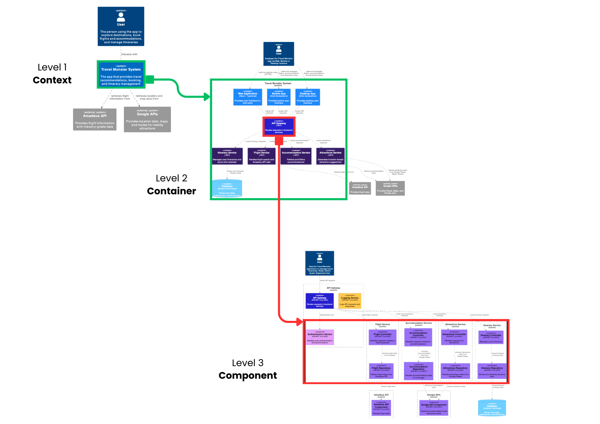
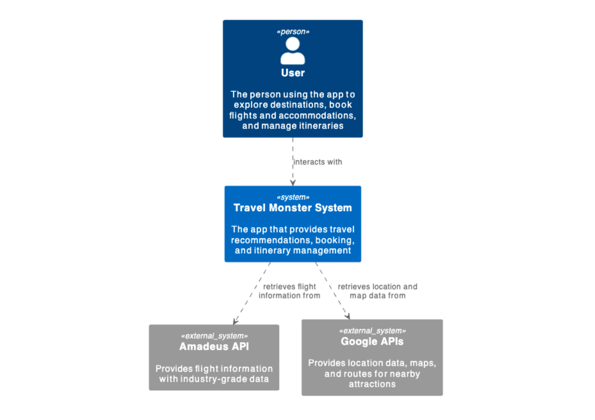
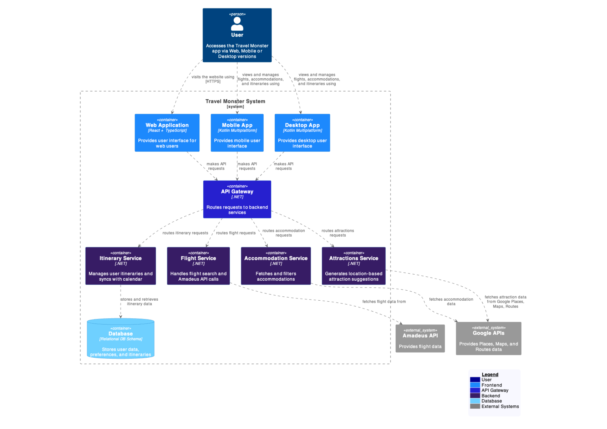
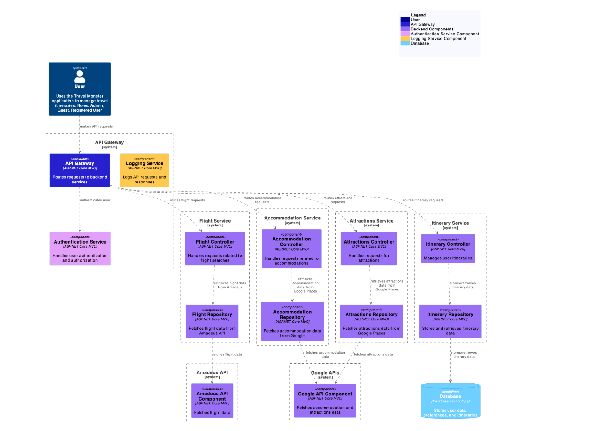

# DEMO
[TravelMonster Demo](https://we.tl/t-tqE23xsa7M)

# Product Vision

**FOR** travelers who want a simple and personalized way to explore new destinations,  
**WHO** need an efficient way to organize itineraries while managing budget constraints and personal preferences,  
**Travel Monster** is a comprehensive travel planning app  
**THAT** provides tailored recommendations and integrated booking options to create a seamless, customized travel experience.  
**UNLIKE** Booking, eSky, and AirPaz,  
**OUR PRODUCT** utilizes a carefully curated selection of real-time data and user inputs to deliver relevant suggestions, optimizing each trip based on preferences to enhance convenience, save time, and control costs.

# Product Features

## Flight Search

INPUT: Database of flights

ACTIVATION: User introduces details of the flight such as date, number of passengers

ACTION: App searches for flights, compares prices in real-time and filters options based on preferences

OUTPUT: A curated list of flight options

## Accommodation Recommendations

INPUT: Database of accommodations

ACTIVATION: User clicks on icon to find accommodations recommended for the location they wish to go to

ACTION: App retrieves and compares accommodation options from multiple booking platforms, filtering them by user preferences

OUTPUT: A list of personalized accommodations options with booking links and reviews

## Nearby Attractions and Activities

INPUT: User's location and personal interests

ACTIVATION: User accesses real time map on the phone 

ACTION: App generates a selection of attractions and activities, based on user interests, location, and current trends

OUTPUT: A map with nearby locations which the user can explore

## Itinerary 

INPUT: Data about the user's trip 

ACTIVATION: User clicks on the "itinerary" icon

ACTION: App organizes items in a daily schedule, syncs with the user's calendar and sets reminders for important events

OUTPUT: A day-by-day travel itinerary with booking details, activity times, and offline access

# User Stories

# Design

## Context Diagram (level 1)

The Context Diagram provides a high-level overview of the Travel Monster application and its interactions with external systems and users.

- **User**: Represents the person using the app to explore destinations, book flights, accommodations, and manage itineraries.
- **Travel Monster System**: The core application that offers travel recommendations, booking services, and itinerary management.
- **External Systems**:
  - **Amadeus API**: Supplies flight information with industry-grade data.
  - **Google APIs**: Offers location data, maps, and routes for nearby attractions.

### Relationships
- The user interacts with the Travel Monster System.
- The Travel Monster System retrieves flight information from the Amadeus API.
- The Travel Monster System fetches location and map data from Google APIs.

## Container Diagram (level 2)

The Container Diagram details the internal architecture of the Travel Monster application, illustrating how different containers interact to serve user needs.

- **User**: Accesses the application via Web, Mobile, or Desktop.
- **Containers**:
  - **Web Application**: Built with React and TypeScript, provides the user interface for web users.
  - **Mobile App**: Developed using Kotlin Multiplatform for mobile user interaction.
  - **Desktop App**: Also developed using Kotlin Multiplatform for desktop user interaction.
  - **API Gateway**: Routes requests to backend services using .NET.
  - **Flight Service**: Handles flight searches and integrates with the Amadeus API.
  - **Accommodation Service**: Fetches and filters accommodations.
  - **Attractions Service**: Suggests location-based attractions.
  - **Itinerary Service**: Manages user itineraries.
  - **Database**: Stores user data, preferences, and itineraries.

### Relationships
- Users interact with the web, mobile, and desktop applications.
- Each frontend container communicates with the API Gateway, which routes requests to the appropriate backend services.

## Component Diagram (level 3)

The Component Diagram breaks down the Travel Monster application into its key components, focusing on the interactions within the backend services.

- **User**: Utilizes the Travel Monster application to manage itineraries, with roles including Admin, Guest, and Registered User.
- **Key Components**:
  - **API Gateway**: Routes requests to the appropriate backend services.
  - **Authentication Service**: Manages user authentication and authorization.
  - **Logging Service**: Logs API requests and responses.
  - **Flight Service**: Contains controllers and repositories for handling flight-related requests.
  - **Accommodation Service**: Manages accommodation data.
  - **Attractions Service**: Handles attraction-related requests.
  - **Itinerary Service**: Manages user itineraries and interacts with the database.
  - **External APIs**: Integrates with Amadeus and Google APIs for flight and accommodation data.

### Relationships
- The user interacts with the API Gateway to make API requests.
- The API Gateway communicates with various services to handle user requests.
- Each service has its own controller and repository for managing data and operations .

# Backlog

# QA

### Components to be Tested
1. Backend
2. Frontend
   
### Testing Levels
1. Unit Testing
2. Integration Testing
3. System Testing
4. Acceptance Testing

## Testing Process

### SDLC Testing Timeline
- Unit tests are performed during the development phase
- Integration tests are conducted after the implementation phase
- Acceptance tests are executed before delivery

## Testing Methods
1. **Unit Testing**: Implemented for React + TypeScript Frontend and .NET Backend
2. **Integration Testing**: Verification of communication between Frontend and Backend
3. **End-to-End (E2E) Testing**: Testing complete application workflows
4. **Load/Performance Testing**: Ensuring scalability

## Implementation Details

### Backend Testing
1. .NET Testing
   - Using xUnit framework
  

2. Endpoint Testing
   - Using Postman/Swagger

### Frontend Testing
1. React + TypeScript Testing
   - Using Jest and React Testing Library
2. Integration Tests for Major Workflows
   

3. E2E Testing
   - Using Cypress

.jpeg)

### CI/CD Analysis
- Implemented using Azure Pipelines

## Security Analysis

### Major Security Risks

#### Backend Risks

1. **SQL Injection**
   - Risk: Users could input malicious code in forms to gain unauthorized data access
   - Solution: 
     - Using EF ORM
     - Query parameterization to prevent SQL injection

2. **Authentication**
   - Risk: Improper authentication management could allow unauthorized access to sensitive resources
   - Solutions:
     - OAuth 2.0 implementation
     - JWT utilization
     - Prevention of session hijacking through HttpOnly, Secure, and SameSite cookie settings

3. **Sensitive Data Exposure**
   - Risk: Protection of passwords, API keys, and user information from data leaks
   - Solutions:
     - Password hashing using bcrypt
     - Proper configuration of appsettings.json to avoid hardcoding sensitive data

#### Frontend Risks

1. **Unsafe Dependencies**
   - Risk: Vulnerabilities in npm packages
   - Solutions:
     - Using npm audit for identification
     - Regular updates using npm update and npm audit fix

#### API Risks

1. **API Key Security**
   - Risk: Potential compromise of Google APIs and Amadeus API keys
   - Solutions:
     - Storing API keys in a Secrets Manager instead of source code
     - Restricting API key usage through IP whitelisting

